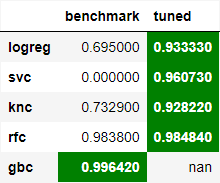

## Basketball Player Recruitment

Photo by [Markus Spiske](https://unsplash.com/@neonbrand) on [Unsplash](https://unsplash.com/photos/BfphcCvhl6E)

## Introduction

The primary objective of this project is to develop a binary classification machine learning model designed to identify potential basketball players for recruitment. 

The underlying assumptions for this project are as follows:

- H0: Do not hire
- H1: Hire

In this context, it is **acceptable to have a higher number of False Negatives (accepting False H0)** than False Positives (rejecting True H0). In simpler terms, it is preferable for the model to classify more candidates as "Do not Hire" (H0) than as "Hire" (H1). This approach is chosen because **hiring underperforming individuals can lead to more substantial costs**. Therefore, in this case, a higher False Negative Rate is considered more favorable than a higher False Positive Rate. Consequently, the chosen metric for the classification process is "**Precision.**"

## Some Findings

The final model employed was a combination of models (green-highlighted) using a voting classifier, which performed well with only 13 misclassifications out of a total of 2229 players, all of which were classified as false negatives. As a result, the final model achieved a 0% False Positive Rate and a 0.143% False Negative Rate.

## The Dataset Description

[Reference Link](https://www.nba.com/stats/help/glossary#astpct)

1. player_name        : Player's name
2. team_abbreviation  : Abbreviated player's team name
3. age                : Age
4. player_height      : Player's height
5. player_weight      : Player's weight
6. college            : Player's College
7. country            : Player's country of origin
8. draft_year         : Draft year
9. draft_round        : Draft round
10. draft_number      : Draft number
11. gp                : Games played *(The number of games played)*
12. pts               : Points *(The number of points scored)*
13. reb               : Rebounds *(A rebound occurs when a player recovers the ball after a missed shot. This statistic is the number of total rebounds a player or team has collected on either offense or defense)*
14. ast               : Assists *(The number of assists -- passes that lead directly to a made basket -- by a player)*
15. net_rating        : Net Rating *(Measures a team's point differential per 100 possessions. On player level this statistic is the team's point differential per 100 possessions while they are on court)*
16. oreb_pct          : Offensive Rebounding Percentage *(The percentage of available offensive rebounds a player or team obtains while on the floor)*
17. dreb_pct          : Defensive Rebounding Percentage *(The percentage of available defensive rebounds a player or team obtains while on the floor)*
18. usg_pct           : Usage Percentage *(The percentage of team plays used by a player when they are on the floor)*
19. ts_pct            : True Shooting Percentage *(A shooting percentage that factors in the value of three-point field goals and free throws in addition to conventional two-point field goals)*
20. ast_pct           : Assist Percentage *(The percentage of teammate field goals a player assisted on while they were on the floor)*
21. season            : Season
22. potential_player  : The labeled player who needs to be recruited.

## Github File Descriptions

1. __basketball_player_recruitment.ipynb__ --> notebook file containing data preprocessing, visualization, and modelling process

2. **nba_players.csv** --> csv file for visualization and model training purposes

3. **new_players.csv**  --> csv file for model testing purpose

## Profile

© Benedict Laiman 2021

Get in touch with me through:

- [Linkedin](https://www.linkedin.com/in/benedict-laiman-60401319a/)
- [Discord](https://discordapp.com/users/525654231940857867/)